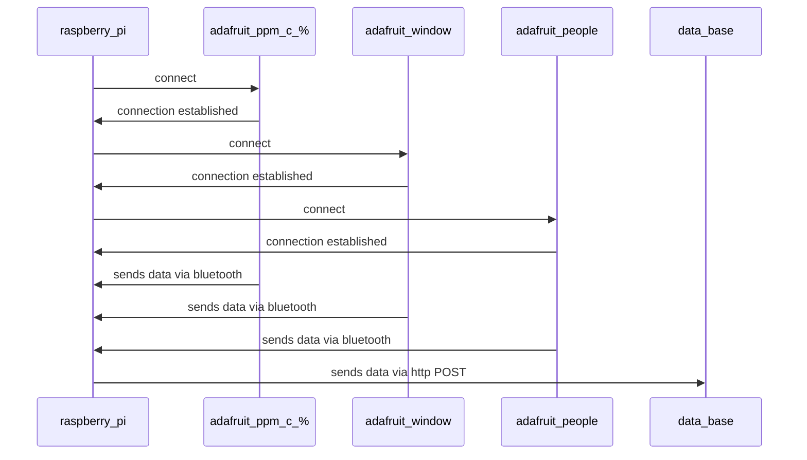
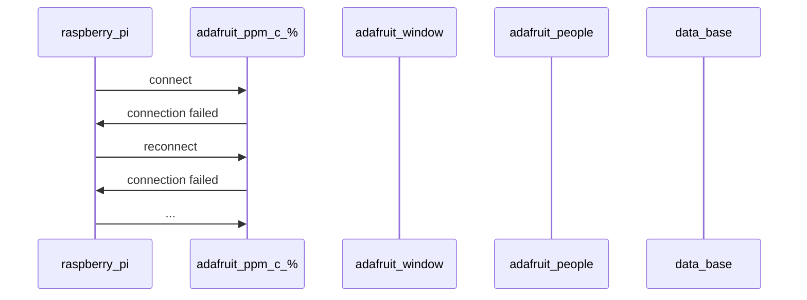

```mermaid
sequenceDiagram
    participant raspberry_pi
    participant adafruit_ppm_c_%
    participant adafruit_window
    participant adafruit_people
    participant data_base
    raspberry_pi->>adafruit_ppm_c_%: connect
    adafruit_ppm_c_%->>raspberry_pi: connection established
    raspberry_pi->>adafruit_window: connect
    adafruit_window->>raspberry_pi: connection established
    raspberry_pi->>adafruit_people: connect
    adafruit_people->>raspberry_pi: connection established
    adafruit_ppm_c_%->>raspberry_pi: sends data via bluetooth
    adafruit_window->>raspberry_pi: sends data via bluetooth
    adafruit_people->>raspberry_pi: sends data via bluetooth
    raspberry_pi->>data_base: sends data via http POST
```

```mermaid
sequenceDiagram
    participant raspberry_pi
    participant adafruit_ppm_c_%
    participant adafruit_window
    participant adafruit_people
    participant data_base
    raspberry_pi->>adafruit_ppm_c_%: connect
    adafruit_ppm_c_%->>raspberry_pi: connection failed
    raspberry_pi->>adafruit_ppm_c_%: reconnect
    adafruit_ppm_c_%->>raspberry_pi: connection failed
    raspberry_pi->>adafruit_ppm_c_%: ...

```
