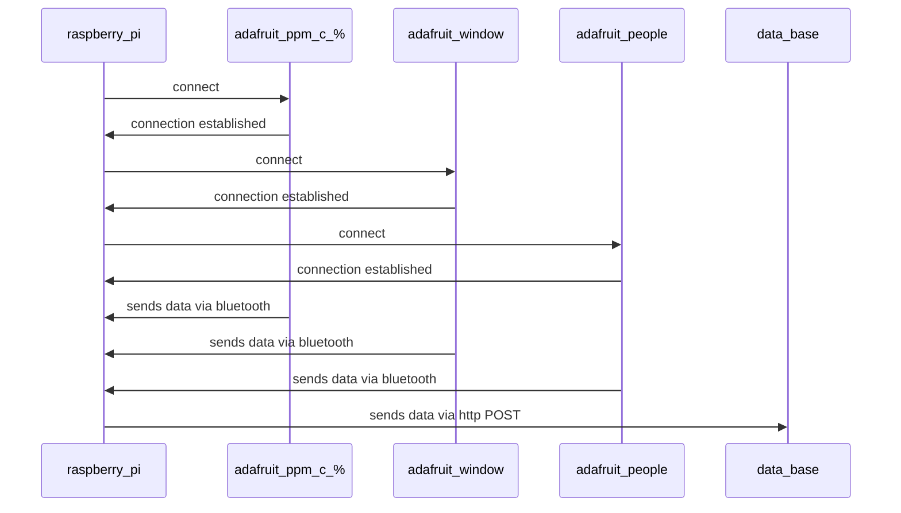
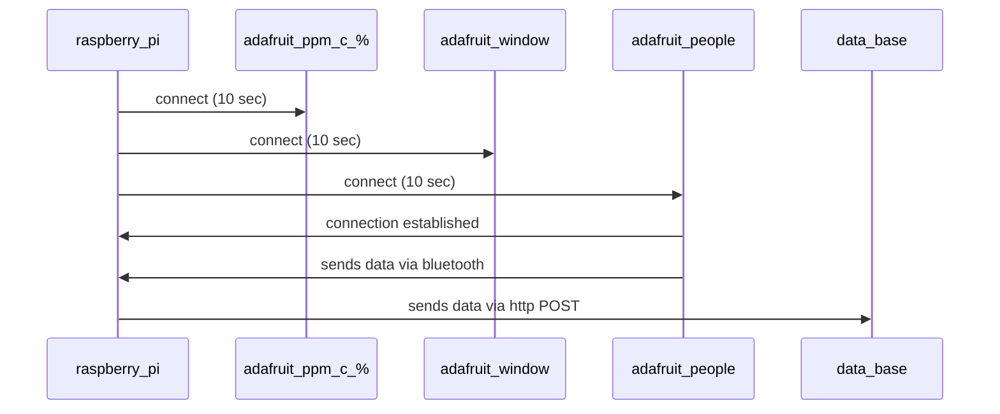
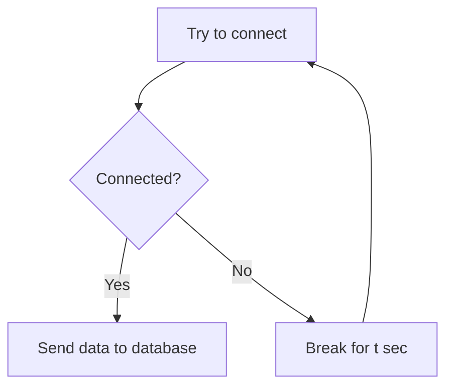

```mermaid
sequenceDiagram
    participant raspberry_pi
    participant adafruit_ppm_c_%
    participant adafruit_window
    participant adafruit_people
    participant data_base
    raspberry_pi->>adafruit_ppm_c_%: connect
    adafruit_ppm_c_%->>raspberry_pi: connection established
    raspberry_pi->>adafruit_window: connect
    adafruit_window->>raspberry_pi: connection established
    raspberry_pi->>adafruit_people: connect
    adafruit_people->>raspberry_pi: connection established
    adafruit_ppm_c_%->>raspberry_pi: sends data via bluetooth
    adafruit_window->>raspberry_pi: sends data via bluetooth
    adafruit_people->>raspberry_pi: sends data via bluetooth
    raspberry_pi->>data_base: sends data via http POST
```

```mermaid
sequenceDiagram
    participant raspberry_pi
    participant adafruit_ppm_c_%
    participant adafruit_window
    participant adafruit_people
    participant data_base
    raspberry_pi->>adafruit_ppm_c_%: connect (10 sec)
    raspberry_pi->>adafruit_window: connect (10 sec)
    raspberry_pi->>adafruit_people: connect (10 sec)
    adafruit_people->>raspberry_pi: connection established
    adafruit_people->>raspberry_pi: sends data via bluetooth
    raspberry_pi->>data_base: sends data via http POST

```

```mermaid
flowchart TD
A[Try to connect] --> B{Connected?};
B -- Yes --> C[Send data to database];
B -- No --> D[Break for t sec];
D --> A;
```
```
